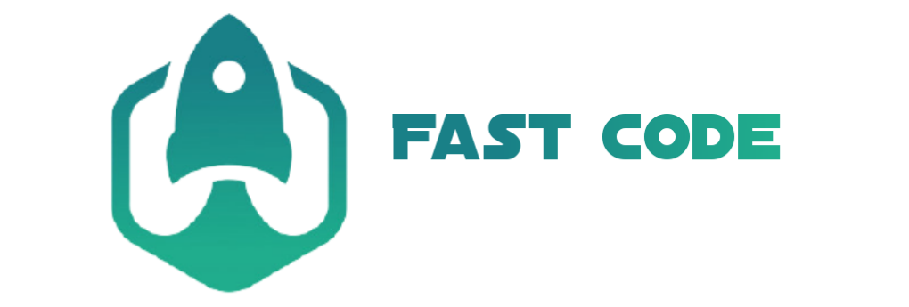

<h1 align="center">
    
</h1>

 

  

## 🚀 Tecnologias

Esse projeto foi desenvolvido com as seguintes tecnologias:

- HTML5
- CSS3
- JavaScript

## 💻 Projeto

O FastCode é uma plataforma de estudos online que ajuda pessoas a encontrarem exemplos de códigos para seu projeto! (Apenas landingpage).

## 🔖 Layout

100% autoral.

 

---

## Licença

Esse projeto está sob a licença MIT. Veja o arquivo [LICENSE](LICENSE.md) para mais detalhes.
